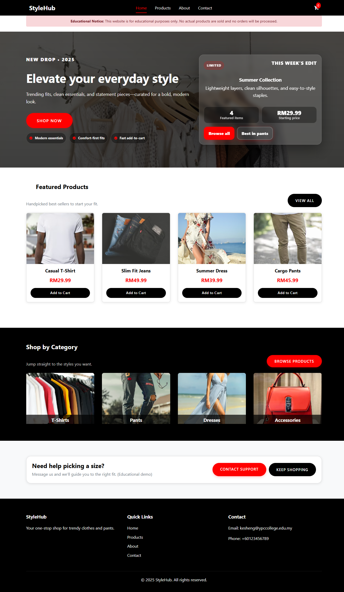
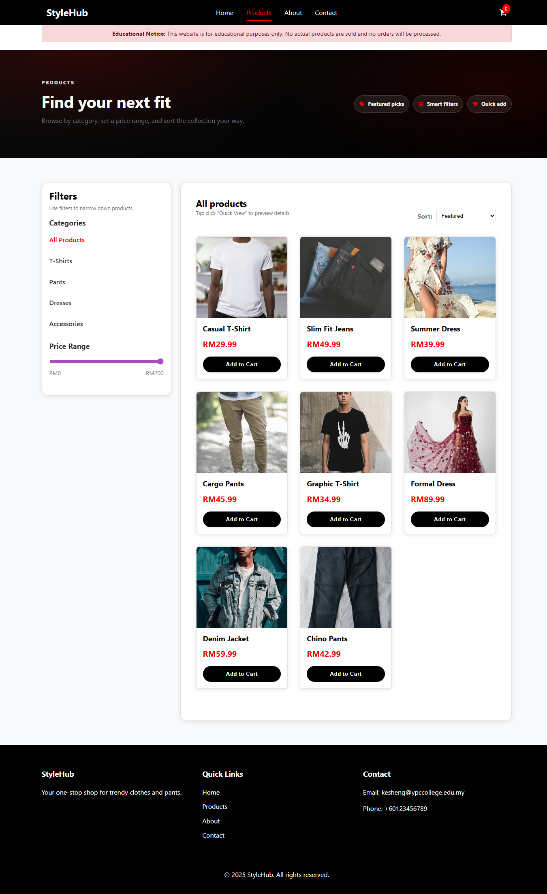
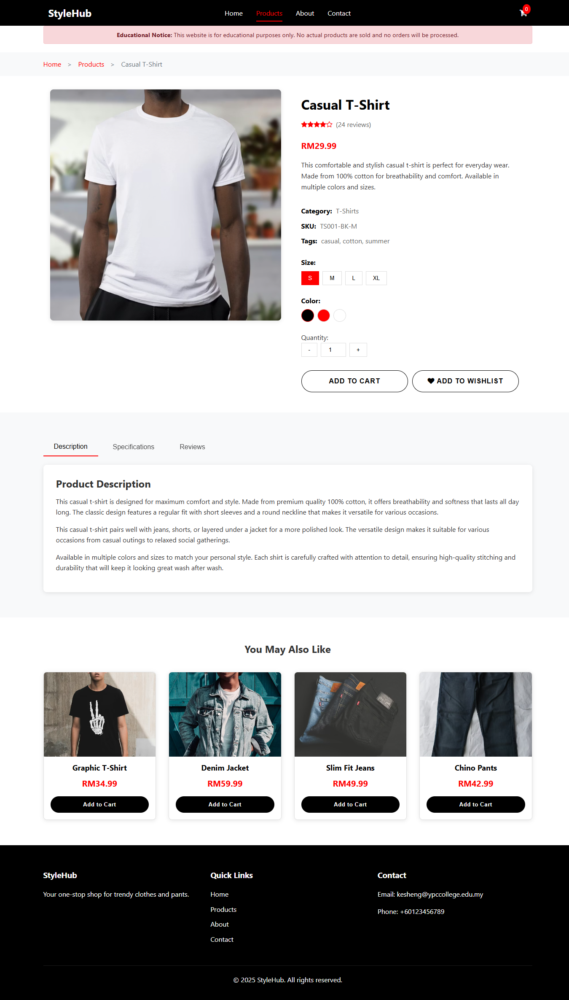
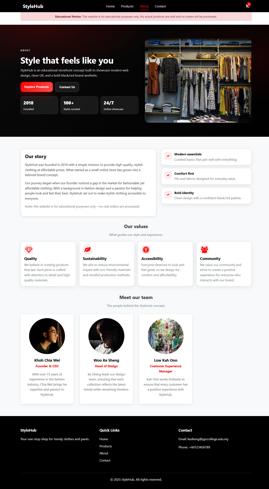
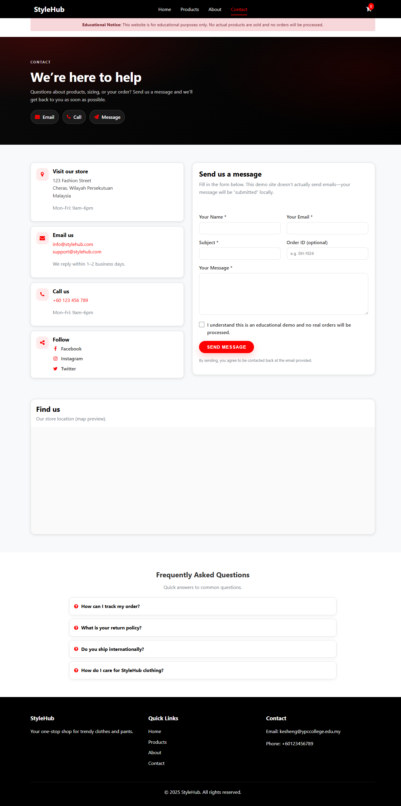
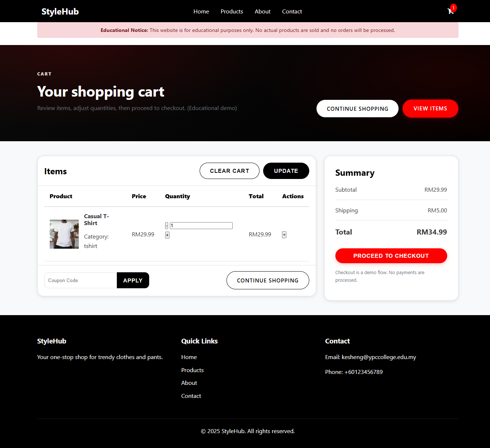

# StyleHub
A modern e-commerce website for browsing and shopping clothing items.

---

## Overview
StyleHub is a fashion-focused e-commerce website designed to provide a smooth and visually appealing online shopping experience. It allows users to explore clothing collections, view product details, and interact with a clean and responsive interface.

This project was developed as a portfolio piece to demonstrate web development, UI/UX design, and e-commerce functionality.

---

## Features
- Browse clothing products
- View product details
- Easy navigation between categories
- Modern and clean UI layout
- Shopping cart functionality
- Wishlist feature
  
---

## Screenshots
- Home Page
  

- Products Page
  

- Product Details Page
  

- About Page
  

- Contact Page
  

- Shopping Cart Page
  

---